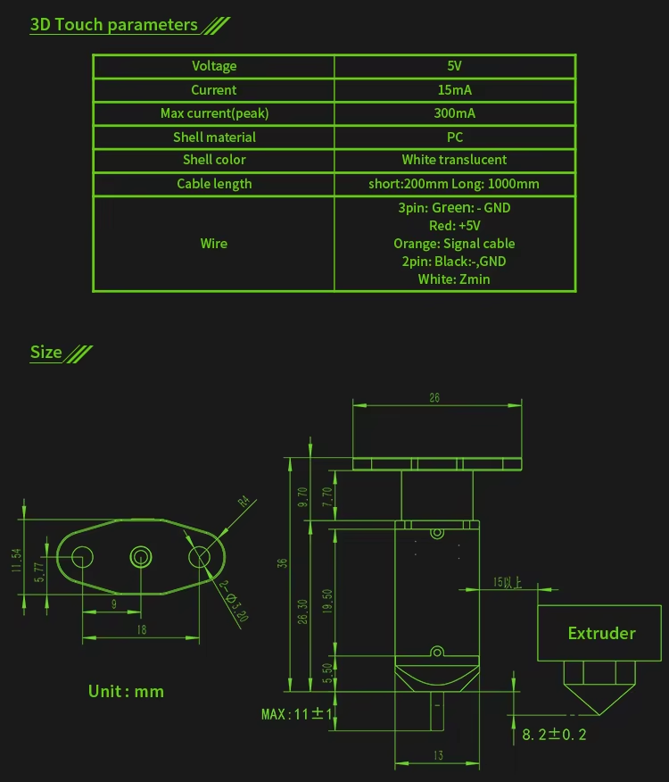

# BLTouch Sensor — Complete Technical Report

> **Machine:** JG Maker Magic V1.1 + **BLTouch**
> **MCU:** ATmega2560 (TQFP-100) · **Board:** `BOARD_RAMPS_14_EFB` = 1020
> **Firmware:** Marlin **2.0.5.4** "Magic v0.3.3"
> **Scope of this document:** every fact about the BLTouch sensor — hardware wiring, pin path, firmware logic, configuration, G-code, trigger behaviour, and the exact build identity.
> **Constraint:** read-only analysis only. **No firmware change, no config change, no upload. WRITE OPERATIONS = 0.**

---

## 0. Executive summary (one-glance)

| Item | Value |
|---|---|
> **PIN MAP UPDATE 2026-09-21 (SUPERSEDES all «virtual servo / SERVO0=15» claims below):** BLTouch servo = **D19** (`SERVO0_PIN 19`, Z+ connector, yellow wire); trigger = **D18** (Z− connector, white wire); X− endstop = **D3/PE5/pin 7**; runout = **D4**. See `docs/HARDWARE/PIN_MAP_DEFINITIVE.md`.

| Probe type | **BLTouch** (servo-emulating, Hall-effect, smart/clone-agnostic) |
| Probe → control signal | **REAL WIRE** — `SERVO0_PIN=19` (D19, Z+ connector, yellow servo wire) |
| Probe → trigger signal | `BLTouch → Z− connector (Z-S) → D18 → PD3 → TQFP pin 46 → Z_MIN_PIN = 18` |
| Probe power | `J1-V = +5 V (board rail)` · `Z-G / J1-G = GND` |
| `Z-V` | **+5 V board rail — UNUSED for the BLTouch** |
| Active invert define | **`Z_MIN_ENDSTOP_INVERTING = true`** (the one actually read) |
| Probe pin source | **Z_MIN endstop pin** (`Z_MIN_PROBE_USES_Z_MIN_ENDSTOP_PIN`) |
| Trigger logic | active-low: triggered when `READ(Z_MIN_PIN) != true` |
| Wire colours | **3D Touch spec (single source):** 3-pin = Green=GND, Red=+5V, Orange=Signal · 2-pin = Black=GND, White=Zmin |
| Probe ratings | 5 V / 15 mA / 300 mA peak · PC shell · cable 200 or 1000 mm |
| BLTOUCH_DELAY | **500 ms** (default, no override) |
| Firmware patch needed | **NONE (0 lines changed)** |
| Build identity (SHA-256, `Marlin.hex`) | `d18cdd87c028da4ef023c86b98a3735873fd81967a0012c730cff81150c12bbf` |
| HEX range | `0x00000 – 0x2B435` (177206 B) → **NO OVERLAP** with bootloader `0x3E000` |

---

## 1. What a BLTouch is and how it is driven

The BLTouch is **not** a plain servo and **not** a plain endstop switch. It is a smart probe that **emulates a PWM servo** on its control line and exposes a digital **trigger output** on its signal line.

- **Control line (REAL WIRE, SERVO0_PIN=19/D19, разъём Z+, жёлтый провод — ИСПРАВЛЕНО 2026-09-21, «virtual» ОТЗЫВАЕТСЯ):** Marlin drives BLTouch commands via `MOVE_SERVO(Z_PROBE_SERVO_NR, angle)` on the D19 servo line. The "angle" is actually a **command code** the BLTouch understands (`bltouch.h`):

  | Command | "Angle" value sent | Meaning |
  |---|---|---|
  | `BLTOUCH_DEPLOY` | `10` | Pin down (ready to trigger) |
  | `BLTOUCH_SW_MODE` | `60` | Switch mode (10 ms pulse out) |
  | `BLTOUCH_STOW` | `90` | Pin up / clear trigger |
  | `BLTOUCH_SELFTEST` | `120` | Diagnostic |
  | `BLTOUCH_MODE_STORE` | `130` | Store voltage mode to probe EEPROM |
  | `BLTOUCH_5V_MODE` | `140` | 5 V output mode (V3.0/3.1) |
  | `BLTOUCH_OD_MODE` | `150` | Open-drain output mode |
  | `BLTOUCH_RESET` | `160` | Clear alarm / reset |

- **Signal line (Z-S → D18):** a digital input. The BLTouch pulls it to a "triggered" level on contact. Because the firmware routes this through the **Z_MIN endstop pin**, the trigger is read exactly like a Z endstop (see §4).

> **Wiring note (from firmware comments):** the two signal-side wires are **not** interchangeable like a real switch. If the trigger is not recognised, the BLTouch documentation says the classic symptom is the two signal wires being swapped. Here they are fixed on the board: **Z-S = D18/PD3 (signal)**, **Z-G = GND (signal return)**.

---

## 2. Final physical wiring (VERIFIED by board measurements)

```
BLTouch SERVO (управление, жёлтый) → разъём Z+ → D19 → PD4 → TQFP 47 → Marlin SERVO0_PIN (=19)
BLTouch VCC (+5V, красный)         → разъём Z+ → +5V  (board rail)
BLTouch GND (зелёный)             → разъём Z+ → GND (board rail)
BLTouch SIGNAL (триггер, белый)   → разъём Z− → Z-S → D18 → PD3 → TQFP 46 → Marlin Z_MIN_PIN (=18)
BLTouch GND (чёрный)              → разъём Z− → GND (board rail)
```

> **PIN MAP 2026-09-21 (SUPERSEDES «virtual servo»):** BLTouch SERVO — **реальный провод на D19** (`SERVO0_PIN 19`, разъём Z+). Ниже в тексте остались исторические блоки «VIRTUAL/SERVO0=15» — они **ОТЗЫВЫВАЮТСЯ**. Источник истины: `docs/HARDWARE/PIN_MAP_DEFINITIVE.md`.

> **Definitive connector map (user-confirmed 2026-09-21):** BLTouch = **Z− + Z+ ports**; X− port = **D3 (PE5, TQFP pin 7) = X endstop**; X+ port = **D4 = filament runout**. The old «J1-S → D3 = BLTouch SERVO» interpretation is **RETRACTED**: D3 carries the X− endstop.

**Standard 5 functional wires (FUNCTION → BOARD CONTACT):**

| # | Function | Board contact |
|---|---|---|
| 1 | CONTROL (servo, жёлтый) | **D19** — разъём Z+ (`SERVO0_PIN 19`) |
| 2 | VCC (+5 V) | Z-port power line |
| 3 | GND (servo/power) | Z-port GND line |
| 4 | SIGNAL (probe input) | **Z-S** |
| 5 | GND (probe/signal) | **Z-G** |

**Group structure (standard BLTouch = 3-wire servo + 2-wire probe):**

| Group | Contacts |
|---|---|
| 3-wire side (servo) | **J1-V, J1-G, J1-S** — исторический разъём J1; **на этой плате J1-S (D3) занят концевиком X−**, серво-команды BLTouch эмулируются на Z-S (D18) |
| 2-wire side (probe) | **Z-S, Z-G** |

**Wire colours — official JG Maker Magic 3D Touch spec sheet (single authoritative source):**

> **Source:** JG Maker Magic V1.1 manual, “3D Touch parameters” section. This is the only wire-colour reference available for this probe.

**3-pin connector (J1) — servo / control side:**

| Wire colour | Function | → Board contact |
|---|---|---|
| **Green** | GND | **J1-G** |
| **Red** | +5 V (VCC) | **J1-V** |
| **Orange** | Signal (servo control) | **J1-S** — ⚠️ на этой плате D3 занят X−; серво-команды BLTouch идут по Z-S (D18) |

**2-pin connector (J4) — probe / trigger side:**

| Wire colour | Function | → Board contact |
|---|---|---|
| **Black** | GND | **Z-G** |
| **White** | Zmin (trigger signal) | **Z-S** |

> **⚠️ Note:** This colour scheme (Green/Red/Orange for 3-pin) is the **JG 3D Touch** proprietary coding — it differs from a generic BLTouch (which typically uses Brown/Red/Black). Match wires to the colours above, NOT to generic BLTouch guides.
> **Board-side mapping** (independent of wire colour) is verified by multimeter below: **Z-S=D18 (signal + servo emulation)**; J1-S→D3 measured, but **D3 = X− endstop, NOT BLTouch servo** (retracted).

**Board measurements (multimeter, ground truth):**

| Contact | Measurement | Node |
|---|---|---|
| J1-G | 0 Ω | large electrolytic negative → **GND** |
| J1-V | 0 Ω | large electrolytic positive → **+5 V** |
| J1-S | ~1 Ω | **→ TQFP pin 7 → PE5 → D3 = X− endstop (X_MIN_PIN 3)** — NOT BLTouch control (retracted) |
| J1-V − J1-G (powered) | **5.0 V** | rail present |
| Z-G | 0 Ω | electrolytic negative → **GND** |
| Z-V | 0 Ω | electrolytic positive → **+5 V** |
| Z-S | ~1 Ω | **→ TQFP pin 46 → PD3 → D18 → Z_MIN_PIN** |
| Z-V − Z-G (powered) | **5.0 V** | rail present |

**Node conclusions:**
- **J1-G and Z-G are the same GND node** (both 0 Ω to the same electrolytic negative). There is **no electrical reason** Z-G cannot be the probe-side GND — it is the standard SIG/SIG-GND return pair.
- **J1-V and Z-V are the same +5 V node.** **No wire is needed** to join them — already connected through the board rails.
- `Z-V` is a **+5 V board rail, UNUSED for the BLTouch** (the probe uses `J1-V` for power).

**Forbidden connections (do NOT add a wire):**
- **DO NOT** connect **J1-S to Z-S** — **J1-S (D3) is the X− endstop**, not the BLTouch control.
- **DO NOT** connect **J1-V to Z-V** with a separate wire (already the same +5 V rail).

> **FINAL PHYSICAL WIRING = VERIFIED BY BOARD MEASUREMENTS.**

---

## 2a. Sensor specifications (JG Maker Magic 3D Touch — official manual)

> **Source:** JG Maker Magic V1.1 manual, section **"3D Touch parameters"**. This is the actual probe unit shipped with this machine (a BLTouch-compatible smart probe). Values below are the **manufacturer's datasheet** for this specific probe.

### 2a.1 Electrical ratings

| Parameter | Value | Note |
|---|---|---|
| Operating voltage | **5 V** | matches board rail `J1-V` |
| Operating current | **15 mA** | nominal |
| Max current (peak) | **300 mA** | surge (servo actuator) |
| Shell material | **PC** | polycarbonate |
| Shell colour | **White translucent** | |
| Cable length | **short: 200 mm / long: 1000 mm** | two cable variants |

### 2a.2 Wire colour code (official — single source)

> **Source:** JG Maker Magic V1.1 manual, “3D Touch parameters” section. This is the **only** wire-colour reference for the JG 3D Touch probe (image [`images/bltouch-3dtouch-parameters.png`](images/bltouch-3dtouch-parameters.png)).
>
> 

**3-pin connector (J1) — servo / control side:**

| Wire colour | Function | Board pin |
|---|---|---|
| **Green** | GND | J1-G |
| **Red** | +5 V (VCC) | J1-V |
| **Orange** | Signal (servo control) | J1-S ⚠️ (D3 = X− endstop on this board; servo emulated on Z-S) |

**2-pin connector (J4) — probe / trigger side:**

| Wire colour | Function | Board pin |
|---|---|---|
| **Black** | GND | Z-G |
| **White** | Zmin (trigger signal) | Z-S |

> **⚠️** This is the JG 3D Touch proprietary colour scheme. It is **not** the generic BLTouch scheme (Brown/Red/Black). Wire the **physical** probe according to the colours above.
> **Cross-check:** the JG Marlin-settings guide notes “3pin → servo/BLTouch connector, 2pin → Zmin connector”. On this board the measured mapping is **Z-S=D18 (signal + servo emulation)**; the J1-S→D3 probe measured ~1 Ω but **D3 carries the X− endstop** (user-confirmed) — the old «D3 = BLTouch servo» reading is retracted.

### 2a.3 Mechanical dimensions (mm)

| Dimension | Value |
|---|---|
| Overall height | **36** |
| Top bracket width | **26** |
| Tip max height | **MAX 11 ± 1** |
| Mounting clearance to extruder | **8.2 ± 0.2** |
| Extruder offset (horizontal) | **15** |
| Mounting tab width | **13** |
| Mounting slot width | **9** |
| Mounting tab overall | **18** |
| Mounting hole clearance | **R2 / 2-Φ0.5-2D** |
| Vertical stack (top→bracket→body) | **26.30 / 19.50 / 5.50** |
| Bracket offset from top | **9.70 / 7.70** |

> These dimensions confirm the probe is the **low-profile "3D Touch"** variant (not a tall servo BLTouch) — consistent with the JG Maker Magic V1.1 design and the `NOZZLE_TO_PROBE_OFFSET { 46, 14, 0 }` already configured in `Configuration.h`.

> **FINAL PHYSICAL WIRING = VERIFIED BY BOARD MEASUREMENTS + OFFICIAL WIRE COLOURS.**

---

## 3. Pin path — Marlin → Arduino → AVR → TQFP → board contact

> D# → AVR port verified from `hardware/arduino/avr/variants/mega/pins_arduino.h`.
> TQFP-100 physical pin per **Microchip DS40002211A Figure 1-1** (directive); pins **7 / 46** additionally confirmed by multimeter.

| Signal | Marlin define | Arduino | AVR | TQFP-100 | Board contact | Role |
|---|---|---|---|---|---|---|
| BLTouch SERVO (управление) | `SERVO0_PIN = 19` | **D19** | **PD4** | **pin 47** | **Z+ S (жёлтый)** | **REAL WIRE** (USER-CONFIRMED 2026-09-21; «virtual/15» RETRACTED) |
| BLTouch SIGNAL (триггер) | `Z_MIN_PIN = 18` | **D18** | **PD3** | **pin 46** | **Z− S (белый)** | trigger input |
| VCC | board rail | — | — | — | Z-port | +5 V |
| GND | board rail | — | — | — | Z-port | common GND |
| (ref) probe ref | — | D52 | PB1 | pin 20 | — | multimeter ~1 Ω |

**Closed, VERIFIED D# → port → TQFP (do not revisit):**
```
D2  = PE4 = TQFP pin 6      (unused — was the wrong X− guess, RETRACTED)
D3  = PE5 = TQFP pin 7      ← X− ENDSTOP (X_MIN_PIN 3)
D4  = PG5 = TQFP pin 1      ← filament RUNOUT (FIL_RUNOUT_PIN 4)
D5  = PE3 = TQFP pin 5
D6  = PH3 = TQFP pin 15
D14 = PJ1 = TQFP pin 64
D19 = PD4 = TQFP pin 47     ← SERVO0_PIN (REAL WIRE, Z+ разъём, жёлтый) — ИСПРАВЛЕНО 2026-09-21
D18 = PD3 = TQFP pin 46     ← BLTouch SIGNAL (Z-S)
```
Plus: `PB1 = pin 20`, `PD4 = pin 47`, `XTAL2/PB4 = pin 33`, `XTAL1/PB3 = pin 34`.

---

## 4. Which invert define is actually used (definitive)

This was the key logic question and it is now resolved by tracing the preprocessor chain.

**Chain:**
1. `Configuration.h` L837 → **`#define Z_MIN_PROBE_USES_Z_MIN_ENDSTOP_PIN`** is **ENABLED**.
2. `Conditionals_LCD.h`:
   ```
   #if DISABLED(Z_MIN_PROBE_USES_Z_MIN_ENDSTOP_PIN)
     #define HAS_CUSTOM_PROBE_PIN 1
   #endif
   ```
   → Since `Z_MIN_PROBE_USES_Z_MIN_ENDSTOP_PIN` **is** defined, **`HAS_CUSTOM_PROBE_PIN` is NOT set**.
3. `bltouch.cpp` `BLTouch::triggered()` (the live probe read):
   ```cpp
   bool BLTouch::triggered() {
     return (
       #if ENABLED(Z_MIN_PROBE_USES_Z_MIN_ENDSTOP_PIN)
         READ(Z_MIN_PIN) != Z_MIN_ENDSTOP_INVERTING
       #else
         READ(Z_MIN_PROBE_PIN) != Z_MIN_PROBE_ENDSTOP_INVERTING
       #endif
     );
   }
   ```
   → The **first** branch is compiled.
4. Same pattern in `probe.cpp` `PROBE_STOWED()` (L401–403) and `endstops.cpp` `report_states()` (M119).

**Conclusion (active vs inert):**

| Define | Value (Configuration.h) | Status in this build |
|---|---|---|
| `Z_MIN_ENDSTOP_INVERTING` (L657) | **`true`** | **ACTIVE** — this is the value actually read |
| `Z_MIN_PROBE_ENDSTOP_INVERTING` (L661) | `true` | **INERT** in this path (only used when `HAS_CUSTOM_PROBE_PIN`) |

**Trigger semantics:** with `Z_MIN_ENDSTOP_INVERTING = true`, the probe is **triggered** when `READ(Z_MIN_PIN) != true`, i.e. **active-low** — exactly the BLTouch behaviour (pin pulled to a triggered level on contact). **Value `true` is correct → leave as-is. No change required.**

> Because both defines happen to be `true`, even if the other branch were taken the behaviour would be identical. The definitive answer, though: **`Z_MIN_ENDSTOP_INVERTING` is the active define.**

---

## 5. Full BLTouch configuration (as built)

### 5.1 Core probe config — `Configuration.h`

| Line | Define | Value | Meaning |
|---|---|---|---|
| L837 | `Z_MIN_PROBE_USES_Z_MIN_ENDSTOP_PIN` | **(enabled)** | Probe on the **Z_MIN** endstop pin (D18) |
| L855 | `//#define Z_MIN_PROBE_PIN 32` | **commented** | **Not used** (probe is on Z_MIN, not a custom pin) |
| L887 | `Z_PROBE_SERVO_NR` | **0** | BLTouch is servo index 0 |
| L888 | `Z_SERVO_ANGLES` | `{ 10, 90 }` | Deploy / Stow angle codes |
| L892 | `SERVO0_PIN` | **19** | `Configuration.h` override — **D19 (Z+ разъём, жёлтый servo-провод), REAL WIRE** (USER-CONFIRMED 2026-09-21) |
| L897 | `BLTOUCH` | **(enabled)** | BLTouch driver enabled |
| L657 | `Z_MIN_ENDSTOP_INVERTING` | **true** | **ACTIVE** trigger invert |
| L661 | `Z_MIN_PROBE_ENDSTOP_INVERTING` | true | inert (see §4) |
| L969 | `NOZZLE_TO_PROBE_OFFSET` | **`{ 46, 14, 0 }`** | probe is +46 X, +14 Y from nozzle (**NOT changed**) |
| L973 | `MIN_PROBE_EDGE` | 33 | keep-out from bed edges |
| L976 | `XY_PROBE_SPEED` | 8000 | XY travel between probes (mm/m) |
| L982 | `Z_PROBE_SPEED_SLOW` | `FAST/2` | "accurate" probe speed |
| L1010–1012 | `Z_CLEARANCE_*` | 10 / 5 / 5 | deploy / between / multi clearance (mm) |
| L1015 | `Z_PROBE_LOW_POINT` | **−2** | stop depth below trigger point (mm) |
| L1018–1019 | `Z_PROBE_OFFSET_RANGE_MIN/MAX` | ±20 | M851 adjustment range |
| L1369 | `Z_SAFE_HOMING` | **(enabled)** | move probe over bed before Z home |
| L1217 | `AUTO_BED_LEVELING_BILINEAR` | **(enabled)** | leveling method |
| L1264–1265 | `GRID_MAX_POINTS_X/Y` | **6 / 6** | 6×6 grid = 36 probe points |
| L2257 | `NUM_SERVOS` | **1** | only servo 0 present |

### 5.2 Advanced BLTouch options — `Configuration_adv.h` (L607–672)

All are **commented out → defaults**, meaning the safe, generic BLTouch behaviour is used:

| Define | Status | Effect when off (current) |
|---|---|---|
| `BLTOUCH_DELAY` | commented | falls back to **500 ms** (see `Conditionals_post.h` L2054) |
| `BLTOUCH_FORCE_SW_MODE` | commented | no forced SW mode after deploy |
| `BLTOUCH_SET_5V_MODE` | commented | **OD (open-drain) mode** is the effective default |
| `BLTOUCH_FORCE_MODE_SET` | commented | no forced probe-EEPROM write at startup |
| `BLTOUCH_HS_MODE` | commented | **LOW SPEED MODE** homing (intermediate STOW used) |
| `BLTOUCH_LCD_VOLTAGE_MENU` | commented | no LCD voltage menu |

> **Result:** this build uses the **generic BLTouch path** — deploy/stow with 500 ms command delay, low-speed homing (intermediate STOW), open-drain output default, no forced mode writes. This is the most compatible mode for Classic/Smart/clone probes.

---

## 6. Firmware logic — exact call paths (source-verified)

### 6.1 Initialization — `MarlinCore.cpp` → `bltouch.init()`
On startup `BLTouch::init(false)` runs (`bltouch.cpp`):
1. `_reset()` → command `160` (clear alarm),
2. `_stow()` → command `90`,
3. Voltage-mode reconciliation: since `BLTOUCH_FORCE_MODE_SET` is off, it compares the stored `last_written_mode` (EEPROM) against `BLTOUCH_SET_5V_MODE` (off) → **no mode write** by default.

### 6.2 Command primitive — `BLTouch::command()`
```cpp
void command(BLTCommand cmd, millis_t ms) {
  MOVE_SERVO(Z_PROBE_SERVO_NR, cmd);                 // sends the "angle" code to D3
  safe_delay(_MAX(ms, (uint32_t)BLTOUCH_DELAY));      // BLTOUCH_DELAY = 500 ms minimum
  return triggered();                                  // read Z_MIN pin (active-low)
}
```

### 6.3 Deploy / Stow with recovery — `deploy_proc()` / `stow_proc()`
- `deploy()`: issue DEPLOY; if the pin is still "alarm/trigger" → run `clear()` (RESET→STOW→DEPLOY→STOW) and retry once; if still failing → `SERIAL_ERROR_MSG(STR_STOP_BLTOUCH)` + `stop()` (graceful, not a kill).
- `stow()`: issue STOW; on alarm → `_reset()` then retry STOW once; same graceful failure path.

### 6.4 Trigger read — `BLTouch::triggered()` (L93–100)
See §4 — reads `Z_MIN_PIN` and compares to `Z_MIN_ENDSTOP_INVERTING` (**active**).

### 6.5 Homing Z integration — `motion.cpp` (L1566–1580)
```cpp
#if HOMING_Z_WITH_PROBE && ENABLED(BLTOUCH)
  if (axis == Z_AXIS && bltouch.deploy()) return;          // initial DEPLOY before homing
  ...
#if HOMING_Z_WITH_PROBE && ENABLED(BLTOUCH) && DISABLED(BLTOUCH_HS_MODE)
  if (axis == Z_AXIS) bltouch.stow();                       // intermediate STOW (LOW SPEED MODE)
#endif
```
→ In this build (`BLTOUCH_HS_MODE` off), Z homing does **DEPLOY → home → intermediate STOW → re-home** (the classic 2-pass BLTouch homing).

### 6.6 Probe deploy/stow in leveling — `probe.cpp` (L329–334, L401–403)
- `probe_specific_action()`: for a servo probe in LOW SPEED MODE, `deploy/stow` are handled inline per-point (no HS fast path).
- `PROBE_STOWED()` macro (L401–403): reads `Z_MIN_PIN != Z_MIN_ENDSTOP_INVERTING` (again the **active** path).

### 6.7 Endstop report (M119) — `endstops.cpp` `report_states()` (L423+)
Before reporting, it sends `bltouch._set_SW_mode()` (so the trigger pin reflects state), then reports the Z_MIN/probe state — consistent with the active-invert logic above.

### 6.8 Self-test & detection — `M43.cpp` (L167–186)
> **⚠️ CORRECTION (2026-09-19, verified at runtime):** `M43.cpp` is compiled under `#if ENABLED(PINS_DEBUGGING)`, which is **commented out** at `Configuration_adv.h:3142`. Runtime answer: `echo:Unknown command: "M43"`. The logic below describes the UPSTREAM code, not what this build executes.

`M43` runs a live detection sequence: `_reset → _stow → _set_SW_mode → _deploy → _stow`, checking the signal transitions, and prints **`= BLTouch Classic 1.2, 1.3, Smart 1.0, 2.0, 2.2, 3.0, 3.1 detected`** on success, then asks the user to trigger within 30 s and measures the pulse.

### 6.9 EEPROM persistence — `configuration_store.cpp`
`bltouch.last_written_mode` (0 = OD, 1 = 5 V) is saved/restored in settings, so a chosen voltage mode survives power cycles.

---

## 7. G-code control surface (BLTouch-specific)

| G-code | Purpose | BLTouch relevance |
|---|---|---|
| **M43** | Test endstop / probe | **DISABLED in this build** (`PINS_DEBUGGING` off) — runtime: `Unknown command` (see §6.8) |
| **M119** | Report endstop states | Sends SW mode, reports probe trigger state |
| **M281** | Set servo angles | **Blocked for BLTouch** — `M281.cpp` L33–35 prints *"BLTouch angles can't be changed."* (must use BLTouch command codes) |
| **G28** | Home | Z homing uses DEPLOY → home → STOW (low-speed mode) |
| **G29** | Auto bed level (Bilinear) | 6×6 grid probe (36 pts) using BLTouch trigger |
| **G76** | Single Z probe | clears any BLTouch error before probing (`G76_M871.cpp` L116–117) |
| **M851** | Set Z probe offset | constrained to `Z_PROBE_OFFSET_RANGE_MIN/MAX` (±20) |
| **M280** | (generic servo) | N/A for BLTouch — it is command-coded, not angle-coded |

> **ИСПРАВЛЕНО 2026-09-21:** `SERVO0_PIN = 19` (D19, **REAL WIRE** — жёлтый servo-провод в разъёме Z+). `Z_PROBE_SERVO_NR = 0`, поэтому `MOVE_SERVO(0, code)` идёт по линии D19; при `Z_MIN_PROBE_USES_Z_MIN_ENDSTOP_PIN` часть команд BLTouch дополнительно эмулируется на D18 (Z-S, белый провод — trigger). Старое утверждение «SERVO0=15, virtual, без провода» — **ОТЗЫВАЕТСЯ**.

---

## 8. Configuration consistency verdict

- All required BLTouch defines are present and mutually consistent with the **measured hardware** (BLTouch on Z−/Z+ ports; X− = D3; X+ = D4 runout).
- The **active** invert define (`Z_MIN_ENDSTOP_INVERTING = true`) matches the BLTouch active-low trigger.
- `NOZZLE_TO_PROBE_OFFSET { 46, 14, 0 }` is **untouched** per directive.
- Advanced options are at safe defaults (generic/low-speed, OD mode, 500 ms delay).

> **CURRENT CONFIG ALREADY MATCHES VERIFIED HARDWARE. No firmware patch required (0 lines changed).**

---

## 9. Firmware patch — none required

| Item | Result |
|---|---|
| Lines changed | **0** |
| Reason | Every required define present & consistent with measured wiring; active-invert logic already correct; safe defaults active. |
| Diff | **NONE (empty)** |

---

## 10. Build identity (compile-only, NO upload)

| Item | Value |
|---|---|
| Build command | `make -j$(nproc) HARDWARE_MOTHERBOARD=1020` |
| MCU | **atmega2560** |
| Program (flash) | **177206 bytes (67.6 %)** |
| Data (SRAM) | **6681 bytes (81.6 %)** |
| `Marlin.hex` | `Marlin/applet/Marlin.hex` |
| `Marlin.elf` | `Marlin/applet/Marlin.elf` |
| **HEX range** | **`0x00000 – 0x2B435`** (177206 data bytes) |
| **Bootloader region** | `0x3E000 – 0x3FFFF` (8 KiB) |
| **Overlap** | **NONE** — `0x2B435 < 0x3E000`, gap = **76 747 bytes (0x12BCB)** |
| **SHA-256 (`Marlin.hex`)** | `d18cdd87c028da4ef023c86b98a3735873fd81967a0012c730cff81150c12bbf` |
| SHA-256 (`Marlin.elf`) | `f9f3c5a554d1548a114c5b15ab66d8fa374e560686cb9ab88f306808eb0cb916` |

> **Upload NOT performed. No flash / EEPROM / fuse / lock / bootloader write. WRITE OPERATIONS = 0.**
>
> **⚠️ УСТАРЕЛО (2026-09-21):** после этого была собрана финальная pin map (X−=D3, SERVO0=**19 (REAL WIRE, D19)**,
> FIL_RUNOUT_PIN=4, FIL_RUNOUT_INVERTING=true). Актуальный статус прошивки — см. `docs/FLASHING/FLASH_REPORT.md` и `docs/HARDWARE/PIN_MAP_DEFINITIVE.md`.

---

## 11. Recommended in-situ verification (optional, still read-only)

Before any future flash, the safe order is:
1. BLTouch connected, printer powered, USB→CH340 (COM) active.
2. **M280 P0 S160** (RESET — clears clone alarm state, see `M401_DIAGNOSTIC_REPORT.md` §5/§7).
3. **M119** → expect Z probe OPEN when stowed, TRIGGERED when pin is pressed. **Note:** M119 has a side effect — it sends SW_MODE and ends with `_reset_SW_mode()` (open→DEPLOY, triggered→STOW), i.e. it moves the pin (`endstops.cpp:422-505`).
4. Then (only on explicit instruction) flash `Marlin.hex`, which **cannot** touch the `0x3E000` bootloader region.

---

## 12. Sources / evidence index

| Fact | Source |
|---|---|
| BLTouch command codes & delays | `Marlin/src/feature/bltouch.h` |
| Deploy/stow/trigger/mode logic | `Marlin/src/feature/bltouch.cpp` (L40–205) |
| Active invert path | `bltouch.cpp` L93–100; `probe.cpp` L401–403; `endstops.cpp` L423+ |
| `HAS_CUSTOM_PROBE_PIN` gating | `src/inc/Conditionals_LCD.h` L583–585 |
| `HAS_Z_SERVO_PROBE` | `src/inc/Conditionals_LCD.h` L559 |
| `BLTOUCH_DELAY = 500` default | `src/inc/Conditionals_post.h` L2054 |
| Homing DEPLOY/STOW | `src/module/motion.cpp` L1566–1580 |
| Probe deploy/stow | `src/module/probe.cpp` L329–420 |
| M43 self-test | `src/gcode/config/M43.cpp` L155–235 |
| M281 BLTouch restriction | `src/gcode/config/M281.cpp` L33–35 |
| EEPROM mode store | `src/module/configuration_store.cpp` L760+, L1617+ |
| Pin mapping & board measurements | `REPORT_FINAL.md` (verified) |
| Probe config values | `Configuration.h` (lines listed §5.1) |
| Advanced BLTouch options | `Configuration_adv.h` L607–672 |
| Wire colours & sensor specs | **JG Maker Magic V1.1 manual**, “3D Touch parameters” (single source, §2a.2) |

---

### FINAL HARDWARE PATH: BLTouch → J1/Z− → ATmega2560 → Marlin 2.0.5.4
### WRITE OPERATIONS TO MCU: 0
